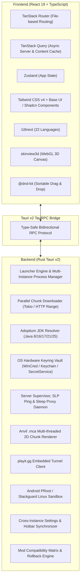

# Ingot — Complete Application Functionality & Architecture Guide

> **Ingot** is a fast, lightweight, all-in-one Minecraft Launcher and Minecraft Server Management Suite built with **Tauri v2 (Rust backend)** and **React 19 + TypeScript + Tailwind CSS (Frontend)**, supporting both Desktop (Windows, macOS, Linux) and Mobile (Android).

---

## Table of Contents

1. [System Architecture & Technology Stack](#1-system-architecture--technology-stack)
2. [Global Application Shell & Navigation Tree](#2-global-application-shell--navigation-tree)
3. [Page 1: Instances (`/`) — Client Launcher Hub](#3-page-1-instances---client-launcher-hub)
4. [Page 2: Discover / Modpacks (`/modpacks`) — Unified Content Browser](#4-page-2-discover--modpacks-modpacks--unified-content-browser)
5. [Page 3: Skins (`/skins`) — Skin Studio & Catalog](#5-page-3-skins-skins--skin-studio--catalog)
6. [Page 4: Screenshots (`/screenshots`) — Visual Gallery](#6-page-4-screenshots-screenshots--visual-gallery)
7. [Page 5: Servers (`/servers`) — Full Server Management Suite](#7-page-5-servers-servers--full-server-management-suite)
   - [7.1 Server Workspaces & Core Architecture](#71-server-workspaces--core-architecture)
   - [7.2 Overview Panel](#72-overview-panel)
   - [7.3 Console Panel](#73-console-panel)
   - [7.4 Players & Access Panel](#74-players--access-panel)
   - [7.5 World Map Panel](#75-world-map-panel)
   - [7.6 Plugins, Mods & Bedrock Packs Panel](#76-plugins-mods--bedrock-packs-panel)
   - [7.7 Server Settings & Config Editor](#77-server-settings--config-editor)
   - [7.8 Server Creation Wizard](#78-server-creation-wizard)
   - [7.9 Mobile Server Dashboard (Android)](#79-mobile-server-dashboard-android)
8. [Page 6: Settings (`/settings`) — Global Configuration](#8-page-6-settings-settings--global-configuration)
9. [Under-the-Hood Backend Engines & Protocols](#9-under-the-hood-backend-engines--protocols)
10. [Global Dialogs & System Overlays](#10-global-dialogs--system-overlays)

---

## 1. System Architecture & Technology Stack

Ingot combines a native Rust engine for heavy I/O, process orchestration, and network protocols with a modern React frontend:



### Key Technologies
- **Frontend**: React 19, TypeScript, TanStack Router (`@tanstack/react-router`), TanStack Query, Tailwind CSS v4, `@dnd-kit/sortable`, `skinview3d`, `lucide-react`, `valibot`, `sonner`.
- **Backend (Rust)**: Tauri v2, Tokio async runtime, `reqwest`, `keyring-rs`, `taurpc`, custom Anvil `.mca` chunk decoder, embedded `playit.gg` tunnel client, `proot` mobile sandbox.
- **Companion Jars**: Custom Java plugins (`ingot-companion-paper.jar` & `ingot-companion-fabric.jar`) providing real-time TPS, player inventories, and in-memory chunk feeds.

---

## 2. Global Application Shell & Navigation Tree

The app layout is anchored by [`__root.tsx`](file:///src/routes/__root.tsx) and [`sidebar.tsx`](file:///src/components/layout/sidebar.tsx):

```
┌────────────────────────────────────────────────────────────────────────┐
│ WindowFrame (Frameless Title Bar, Drag Region, Window Minimize/Max/Close)│
├────┬───────────────────────────────────────────────────────────────────┤
│    │ Update Banner (Visible when application updates are available)    │
│ S  ├───────────────────────────────────────────────────────────────────┤
│ I  │                                                                   │
│ D  │  PAGE OUTLET:                                                     │
│ E  │                                                                   │
│ B  │  [ / ]           Instances (Client Launcher & Quick Play)         │
│ A  │  [ /modpacks ]   Discover (Modrinth & CurseForge Content Hub)     │
│ R  │  [ /skins ]      Skins (3D Studio, Catalog & Account Sync)       │
│    │  [ /screenshots ]Screenshots (Multi-instance Gallery & Lightbox)  │
│    │  [ /servers ]    Servers (Dedicated Host, Map, Console, Players)  │
│    │  [ /settings ]   Settings (Accounts, RAM, Window, Sync, Lang)     │
│    │                                                                   │
│────┴───────────────────────────────────────────────────────────────────┤
│ [Account Switcher] (Compact Avatar, 1-Click Profile Switching, Keyring)│
└────────────────────────────────────────────────────────────────────────┘
```

### Global Overlays & Modals
- **`WindowFrame`**: Custom desktop window titlebar supporting maximize, minimize, restore, and close with seamless OS integration.
- **`AccountSwitcher`**: Docked at the bottom of the sidebar. Shows active player skin avatar, account name, account provider badge (Microsoft, Ely.by, Offline). Allows instant 1-click active account switching.
- **`FirstLaunchLanguageDialog`**: Prompts the user on first launch with an auto-detected language selector (22 supported languages).
- **`VersionChangeCrashDialog`**: Automatically catches Minecraft client crashes occurring shortly after a version or loader migration and presents a 1-click restoration to previous backups.
- **`LeftoverServersDialog`**: Detects orphan background server processes from previous sessions on boot and offers to reconnect or stop them.
- **`QuitDialog`**: Intercepts app close requests when servers or game instances are actively running, preventing data loss by offering clean world saving.
- **`Toaster`**: Sonner toast system with unified alert tones (success, info, warning, destructive).

---

## 3. Page 1: Instances (`/`) — Client Launcher Hub

**Route**: [`src/routes/index.tsx`](file:///src/routes/index.tsx)  
**Purpose**: Primary command center for managing and launching Minecraft client instances.

```
┌─────────────────────────────────────────────────────────────────────────────────┐
│ [Search instances...]          [ + Create Instance ]   [ ⬇ Import from Launcher ]│
├─────────────────────────────────────────────────────────────────────────────────┤
│ 🟢 Active Instances (2): Vanilla 1.21.4 (PID 14210) [■ Stop]  Fabric (PID 9812) │
├─────────────────────────────────────────────────────────────────────────────────┤
│ 🎮 Minecraft: Bedrock Edition Card (Installed / Launch / Open Data Directory)    │
├─────────────────────────────────────────────────────────────────────────────────┤
│ All Instances (4)                                                               │
│ ┌───────────────────────┐ ┌───────────────────────┐ ┌─────────────────────────┐ │
│ │ Fabric 1.21.4         │ │ Vanilla 1.20.1        │ │ NeoForge 1.21           │ │
│ │ Last played: 2h ago   │ │ Last played: Yesterday│ │ Last played: Never      │ │
│ │ RAM: 4096 MB          │ │ RAM: Global Default   │ │ RAM: 6144 MB            │ │
│ │ [ Play ▾ ]  [⚙] [...] │ │ [ Play ▾ ]  [⚙] [...] │ │ [ Play ▾ ]   [⚙] [...]  │ │
│ └───────────────────────┘ └───────────────────────┘ └─────────────────────────┘ │
└─────────────────────────────────────────────────────────────────────────────────┘
```

### Key Features & Components
1. **Search & Filter Header** ([`instance-search-header.tsx`](file:///src/components/instances/instance-search-header.tsx)):
   - Instant live search by instance name, Minecraft game version, or mod loader.
   - Quick action buttons to launch **Create New Instance** or **Import Instance**.
2. **Active Running Processes Multi-Banner**:
   - Displays real-time running instances with green pulsing indicators, assigned OS Process ID (PID), and live elapsed playtime counters.
   - Per-instance emergency **Stop Process** button.
3. **Bedrock Edition Integration Card** ([`bedrock-card.tsx`](file:///src/components/instances/bedrock-card.tsx)):
   - Detects Windows Bedrock Edition (Retail or Preview) and Android Bedrock installation.
   - One-click launch into Bedrock Edition or direct shortcut to open the Bedrock local app data directory.
   - Direct setup guidance if Bedrock is not installed.
4. **Instance Card** ([`instance-card.tsx`](file:///src/components/instances/instance-card.tsx)):
   - **Loader Badge**: Vanilla, Fabric, Quilt, NeoForge, Forge with official icons.
   - **Play Controls**:
     - Main `Play` button triggers validation, sync conflict checks, parallel asset downloads, and launch.
     - **Quick Play Dropdown**:
       - `Direct Play`: Standard launch into main menu.
       - `Quick Play Singleplayer`: Dynamically enumerates instance `saves/` worlds with world names and lets user jump directly into a save without opening the title screen.
       - `Quick Play Multiplayer`: Prompts [`direct-connect-dialog.tsx`](file:///src/components/instances/direct-connect-dialog.tsx) to supply server IP/port and launches directly into multiplayer.
   - **Download Progress Indicator**: Live percentage, progress bar, current phase (`Resolving metadata`, `Downloading assets`, `Verifying libraries`, `Extracting natives`), downloaded size / total size.
   - **Context Menu (`...`)**:
     - *Open Instance Directory* in OS File Explorer.
     - *Duplicate Instance* ([`duplicate-instance-dialog.tsx`](file:///src/components/instances/duplicate-instance-dialog.tsx)) with isolated copy of mods/configs.
     - *Instance Settings* ([`instance-settings-dialog.tsx`](file:///src/components/instances/instance-settings-dialog.tsx)).
     - *Delete Instance* with safety confirmation.
5. **New Instance Dialog** ([`new-instance-dialog.tsx`](file:///src/components/instances/new-instance-dialog.tsx)):
   - Select Minecraft version (releases and snapshots fetched live from Mojang manifest).
   - Select Mod Loader: Vanilla, Fabric, Quilt, NeoForge, Forge.
   - Auto-fetches compatible loader versions for the selected game version.
   - Custom instance naming.
6. **Launcher Import Engine** ([`import-instance-dialog.tsx`](file:///src/components/instances/import-instance-dialog.tsx)):
   - Scans system and auto-detects third-party launchers:
     - **CurseForge App**
     - **Modrinth App**
     - **ATLauncher**
     - **Legacy Launcher / TL**
     - **Prism Launcher / MultiMC**
     - **Official Vanilla `.minecraft`**
     - Custom folder picker
   - Selective import checklist: choose whether to copy mods, worlds/saves, resource packs, shaders, screenshots, or configuration files (`options.txt`, `servers.dat`).
7. **Instance Settings & Version Migration Dialog** ([`instance-settings-dialog.tsx`](file:///src/components/instances/instance-settings-dialog.tsx)):
   - **Identity**: Rename instance.
   - **Version Switcher & Smart Migration**: Opens [`change-version-dialog.tsx`](file:///src/components/instances/change-version-dialog.tsx). Evaluates mod compatibility against target game version/loader, warns about downgrades, generates a [`VersionPlan`](file:///src/components/version-change/plan-review.tsx), creates automated world backups, and enables 1-click undo.
   - **Memory & JVM Override**: Per-instance Min RAM and Max RAM sliders, custom Java runtime executable override, and custom JVM launch flags.
   - **Window & Display Override**: Per-instance resolution width/height and fullscreen toggle.
   - **Synchronization Override**: Per-instance sync toggles (options, servers, resource packs, command history, creative hotbars) with push/pull to Sync Master.

---

## 4. Page 2: Discover / Modpacks (`/modpacks`) — Unified Content Browser

**Route**: [`src/routes/modpacks.tsx`](file:///src/routes/modpacks.tsx)  
**Purpose**: Unified discovery and one-click installation engine aggregating content across **Modrinth** and **CurseForge**.

```
┌─────────────────────────────────────────────────────────────────────────────────┐
│ [Search mods, packs, shaders...]                      Category: [ Modpacks ▾ ]  │
│ Source: [ All ▾ ]  Loader: [ Fabric ▾ ]  Version: [ 1.21.4 ▾ ]  Sort: [ Downloads ▾ ]│
├─────────────────────────────────────────────────────────────────────────────────┤
│ [All]  [📦 Modpacks]  [🧩 Mods]  [🎨 Resource Packs]  [☀️ Shaders]              │
├─────────────────────────────────────────────────────────────────────────────────┤
│ ┌──────────────────────┐ ┌──────────────────────┐ ┌───────────────────────────┐ │
│ │ Sodium               │ │ Fabric API           │ │ Iris Shaders              │ │
│ │ by jellysquid3       │ │ by modmuss50         │ │ by coderbot               │ │
│ │ Modrinth · 35M dl    │ │ Modrinth · 60M dl    │ │ Modrinth · 28M dl         │ │
│ │ Modern rendering...  │ │ Core library for...  │ │ Modern shader support...  │ │
│ │ [Details]  [Install] │ │ [Details]  [Install] │ │ [Details]  [Install]      │ │
│ └──────────────────────┘ └──────────────────────┘ └───────────────────────────┘ │
│ < Page 1 of 42 >                                                                │
└─────────────────────────────────────────────────────────────────────────────────┘
```

### Key Features & Components
1. **Aggregated Multi-Provider Search**:
   - Queries Modrinth and CurseForge APIs simultaneously.
   - Provider filter: All, Modrinth only, CurseForge only.
2. **Category Tabs**:
   - `All`: Unified search.
   - `Modpack`: Complete modpacks with client profiles and configurations.
   - `Mod`: Individual gameplay and performance modifications.
   - `Resourcepack`: Textures, fonts, and audio overhauls.
   - `Shader`: GLSL shader packs for Iris, Oculus, or OptiFine.
3. **Faceted Filtering & Sorting**:
   - Filter by Mod Loader: Fabric, Forge, NeoForge, Quilt.
   - Filter by Game Version: Popular versions (1.21.4, 1.20.1, 1.16.5, etc.) or custom string.
   - Sort by: Downloads count, Relevance, Last Updated, Newest.
4. **Content Details Sheet** ([`content-details-dialog.tsx`](file:///src/components/content/content-details-dialog.tsx)):
   - Full Markdown rendered project descriptions and changelogs.
   - Image gallery / screenshots carousel.
   - Version browser listing file releases, target loaders, Minecraft version compatibility, and dependencies.
   - Direct web link to project page.
5. **Install Dialog** ([`install-dialog.tsx`](file:///src/components/content/install-dialog.tsx)):
   - **For Modpacks**: Offers to create a brand-new instance with the modpack name, auto-configuring the required loader and version.
   - **For Mods / Packs / Shaders**: Lets user select which existing instance to install the content into. Automatically matches compatible version files.
   - Live download & extraction progress tracking.

---

## 5. Page 3: Skins (`/skins`) — Skin Studio & Catalog

**Route**: [`src/routes/skins.tsx`](file:///src/routes/skins.tsx)  
**Component**: [`skin-catalog-view.tsx`](file:///src/components/skins/skin-catalog-view.tsx)  
**Purpose**: Complete skin management studio with online browsing, 3D previewing, and direct account synchronization.

```
┌─────────────────────────────────────────────────────────────────────────────────┐
│ Tabs: [ 🌐 Catalog ]   [ 📁 My Skins ]   [ ⬆ Upload Skin ]                       │
│ Filter: [ Classic (Steve) ▾ ]  Sort: [ Most Worn ▾ ]  Search: [ Enter name... ] │
├──────────────────────────────────────┬──────────────────────────────────────────┤
│ Catalog Grid                         │ Interactive 3D Skin Viewer               │
│ ┌────────┐ ┌────────┐ ┌────────┐     │                                          │
│ │ Skin 1 │ │ Skin 2 │ │ Skin 3 │     │               [ 3D Model ]               │
│ │ 32k 👥 │ │ 12k 👥 │ │ 9k 👥  │     │          (Drag to Rotate / Zoom)         │
│ └────────┘ └────────┘ └────────┘     │                                          │
│ ┌────────┐ ┌────────┐ ┌────────┐     │ Model: Slim (Alex 3px)                   │
│ │ Skin 4 │ │ Skin 5 │ │ Skin 6 │     │ [ Apply to Active Account ]              │
│ └────────┘ └────────┘ └────────┘     │ [ Save to My Skins ]  [ Download PNG ]   │
└──────────────────────────────────────┴──────────────────────────────────────────┘
```

### Key Features & Components
1. **Catalog View (Ely.by Online Integration)**:
   - Browses hundreds of thousands of community skins.
   - Search by username or skin tag.
   - Sort by: Wearers (`wearers`), Views (`views`), Cubes/Favorites (`cubes`), Latest (`latest`).
   - Filter by 3D model geometry: Any, Classic Steve (4px arms), Slim Alex (3px arms).
2. **Interactive 3D Skin Viewer** ([`skin-viewer-3d.tsx`](file:///src/components/accounts/skin-viewer-3d.tsx)):
   - WebGL 3D preview powered by `skinview3d`.
   - Full 360° mouse rotation, pan, and zoom controls.
   - Animated walking / idle preview toggle.
   - Outer layer (jacket, sleeves, hat) visibility toggle.
   - Cape visualization support.
3. **Local Skin Library ("My Skins")**:
   - Stores user favorites and downloaded skins offline in `<app_data>/skins/`.
   - Fast 1-click skin switching without re-downloading.
   - Delete, export, and rename saved skins.
4. **Custom Skin Upload**:
   - Upload any local `.png` skin file (64x32 or 64x64 format).
   - Auto-detects Steve vs. Alex arm dimensions with manual override option.
5. **Account Skin Application**:
   - **Microsoft Accounts**: Uploads skin texture directly to Mojang skin servers via official authenticated API.
   - **Ely.by Accounts**: Syncs skin directly to Ely.by profile.
   - **Offline Accounts**: Saves texture locally for client-side rendering.
   - Download Skin PNG button to save texture to user Downloads folder.

---

## 6. Page 4: Screenshots (`/screenshots`) — Visual Gallery

**Route**: [`src/routes/screenshots.tsx`](file:///src/routes/screenshots.tsx)  
**Component**: [`screenshots-view.tsx`](file:///src/components/screenshots/screenshots-view.tsx)  
**Purpose**: Centralized gallery consolidating in-game screenshots across all client instances.

```
┌─────────────────────────────────────────────────────────────────────────────────┐
│ Instance: [ All Instances ▾ ]   Sort: [ Date (Newest) ▾ ]   [ Open Folder ]     │
│ [Search screenshots...]                                                         │
├─────────────────────────────────────────────────────────────────────────────────┤
│ ┌───────────────────────┐ ┌───────────────────────┐ ┌─────────────────────────┐ │
│ │ 🖼 2026-10-02_14.20.png│ │ 🖼 2026-10-01_18.05.png│ │ 🖼 2026-09-28_22.11.png │ │
│ │ 1920x1080 · 1.4 MB    │ │ 1920x1080 · 2.1 MB    │ │ 2560x1440 · 3.5 MB      │ │
│ │ Instance: Fabric 1.21 │ │ Instance: Vanilla 1.20│ │ Instance: Fabric 1.21   │ │
│ │ [👁 Preview] [📋] [🗑] │ │ [👁 Preview] [📋] [🗑] │ │ [👁 Preview] [📋] [🗑]  │ │
│ └───────────────────────┘ └───────────────────────┘ └─────────────────────────┘ │
└─────────────────────────────────────────────────────────────────────────────────┘
```

### Key Features & Components
1. **Aggregated Multi-Instance Scanning**:
   - Automatically crawls `<app_data>/instances/*/screenshots/` and shared screenshots folders.
   - Asynchronous Rust metadata parser extracts resolution dimensions, creation date, and file size.
   - Memory-efficient background thumbnail caching.
2. **Filters & Sorting**:
   - Filter by instance (or view All).
   - Sort by Date (newest/oldest), Name (A-Z/Z-A), or File Size (largest/smallest).
   - Search by filename.
3. **Interactive Fullscreen Lightbox** ([`screenshot-lightbox.tsx`](file:///src/components/screenshots/screenshot-lightbox.tsx)):
   - High-resolution modal viewer with smooth zoom and pan.
   - Keyboard navigation: Left/Right arrows cycle screenshots; `Esc` closes lightbox.
   - Quick actions in lightbox: Copy image to clipboard, Reveal file in OS file explorer, Delete screenshot.
4. **Card Quick Actions**:
   - 1-click copy image to system clipboard.
   - Reveal file in Windows Explorer / macOS Finder / Linux file manager.
   - Delete screenshot with confirmation.
   - Open Screenshots Folder button.

---

## 7. Page 5: Servers (`/servers`) — Full Server Management Suite

**Route**: [`src/routes/servers.tsx`](file:///src/routes/servers.tsx)  
**Component**: [`server-workspace.tsx`](file:///src/components/servers/server-workspace.tsx)  
**Purpose**: Professional-grade dedicated Minecraft server hosting and control suite built directly into Ingot.

---

### 7.1 Server Workspaces & Core Architecture

Ingot supports **10 server cores**:

| Server Core | Category | Description |
|---|---|---|
| **Paper** | Plugin Server | Industry-standard high-performance Bukkit/Spigot fork |
| **Purpur** | Plugin Server | Highly customizable Paper fork with extra gameplay toggles |
| **Fabric** | Modded Server | Lightweight, modular, fast modern modded server |
| **NeoForge** | Modded Server | Modern fork of Forge for 1.20.2+ modpacks |
| **Forge** | Modded Server | Classic modding ecosystem for legacy & modern Minecraft |
| **Quilt** | Modded Server | Fabric-compatible mod loader with enhanced ecosystem tools |
| **Folia** | Multi-threaded | Paper fork splitting world ticks across independent CPU threads |
| **PumpkinMC** | Ultra-light | High-performance C#/Rust alternative server |
| **Bedrock BDS**| Bedrock Dedicated | Official native Mojang Bedrock Dedicated Server |
| **Vanilla** | Official Mojang | Standard official Minecraft Java server jar |

---

### 7.2 Overview Panel

**Component**: [`overview-panel.tsx`](file:///src/components/servers/panels/overview-panel.tsx) & [`overview-cards.tsx`](file:///src/components/servers/panels/overview-cards.tsx)

```
┌─────────────────────────────────────────────────────────────────────────────────┐
│ Server Hero: [Icon] "My Survival World" — 1.21.4 Paper                          │
│ MOTD: "§aWelcome to §bIngot Server§r!" (Formatted Colors & Formatting)          │
│ Status: 🟢 Running (Uptime: 4h 12m)   Players: 3 / 20   Signal: ▂▄▆█            │
│ [ ▶ Start ]   [ 🌙 Sleep ]   [ ■ Stop ]                                         │
├─────────────────────────────────────────────────────────────────────────────────┤
│ Stat Tiles: [ Status: Running ] [ RAM: 3.2 GB / 6 GB ] [ TPS: 20.0 ] [ Players ]│
├─────────────────────────────────────────────────────────────────────────────────┤
│ Performance Gauge: CPU History % | RAM History MB | TPS (20.0) | MSPT (12.4ms)  │
├──────────────────────────────────────┬──────────────────────────────────────────┤
│ Join & Share Card                    │ Console Peek                             │
│ • LAN: 192.168.1.50:25565 [Copy]     │ [14:20:01 INFO]: Server started.         │
│ • Public (playit.gg):                │ [14:20:05 INFO]: Player steve joined.    │
│   region-proxy.playit.gg:19421 [Copy]│ [14:21:10 INFO]: Saving chunks...        │
│ [ 📱 Show QR Code ]  [ 🔗 Share Link]│ [ Open Full Console -> ]                 │
├──────────────────────────────────────┴──────────────────────────────────────────┤
│ Storage Card: Total Size: 1.2 GB (World: 980 MB, Plugins: 180 MB, Backups: 40MB)│
└─────────────────────────────────────────────────────────────────────────────────┘
```

#### Key Capabilities:
- **How Players See It**: Previews the server exactly as it appears in Minecraft's multiplayer menu (custom 64x64 icon, MOTD formatting codes, player count, ping signal bars).
- **Server Controls**:
  - `Start`: Launches JVM process with configured RAM and auto-detected port.
  - `Stop`: Gracefully sends `/stop` command and awaits process termination.
  - `Sleep Mode`: Puts server into hibernation daemon. Shuts down heavy Java process and listens on the port with an ultra-light proxy. When a player connects, the proxy automatically boots the server and connects the player!
- **Performance Card**: Real-time CPU%, RAM usage, live TPS (Ticks Per Second) and MSPT (Milliseconds Per Tick) sampled via Ingot Companion.
- **Join & Share Card**:
  - Auto-detected LAN IP address for same-WiFi friends.
  - Built-in **playit.gg Tunnel**: Provides instant public WAN address without port-forwarding or router access.
  - **QR Code Generator**: Mobile Bedrock players can scan QR code to connect instantly.
  - Quick Invite Share button to copy structured invite text.
  - **Quick Local Join**: 1-click button to launch local client instance directly into this server!
- **Storage Card**: Live breakdown of world disk space, plugin/mod space, and backups with direct Open Folder button.

---

### 7.3 Console Panel

**Component**: [`console-panel.tsx`](file:///src/components/servers/panels/console-panel.tsx)

```
┌─────────────────────────────────────────────────────────────────────────────────┐
│ [Console Output Stream]                                 [Auto-scroll: ON] [📋] [🗑]│
│ [14:00:01 INFO] [Ingot] Booting Paper 1.21.4...                                 │
│ [14:00:04 INFO] Preparing level "world"                                         │
│ [14:00:08 WARN] Plugin 'Essentials' took 450ms to enable                        │
│ [14:00:10 INFO] Done (9.214s)! For help, type "help"                            │
│ [14:01:22 INFO] Alex joined the game                                            │
│ [14:05:10 ERROR] Exception in thread "Server thread" (Destructive highlight)   │
├─────────────────────────────────────────────────────────────────────────────────┤
│ [ /say Hello world                                               ] [ Send ↵ ]   │
└─────────────────────────────────────────────────────────────────────────────────┘
```

#### Key Capabilities:
- **Intelligent ANSI / Syntax Highlighting**: Color-codes errors (red), warnings (yellow), player join/leaves (green), and Ingot system steps (cyan).
- **Command Injection**: Execute any console command (`op player`, `gamemode creative`, `stop`). Auto-strips leading `/`.
- **Command History**: Navigate previous 50 executed commands with `Up` and `Down` arrow keys.
- **Smart Scroll-Lock**: Automatically halts auto-scrolling when user scrolls up to inspect logs; resumes when scrolled to bottom.
- **Log Management**: Copy all logs to clipboard or clear console viewport.

---

### 7.4 Players & Access Panel

**Components**: [`players-panel.tsx`](file:///src/components/servers/panels/players-panel.tsx), [`player-sheet.tsx`](file:///src/components/servers/panels/player-sheet.tsx), [`access-panel.tsx`](file:///src/components/servers/panels/access-panel.tsx)

```
┌─────────────────────────────────────────────────────────────────────────────────┐
│ Tabs: [ 🟢 Online Players (3) ]   [ 👥 All Known Players (18) ]   [ 🛡 Access ]   │
├─────────────────────────────────────────────────────────────────────────────────┤
│ Player: [Alex Avatar]  Alex  · Overworld (X: 120, Y: 64, Z: -450)  Ping: 24ms   │
│ Health: ♥♥♥♥♥♥♥♥♥♥ 20/20   Food: 🍗🍗🍗🍗🍗 20/20   Gamemode: Survival          │
│ [ Inspect Details & Inventory ]                                                 │
└─────────────────────────────────────────────────────────────────────────────────┘
```

#### Detailed Player Sheet Inspector ([`player-sheet.tsx`](file:///src/components/servers/panels/player-sheet.tsx)):
- **Real-Time Vitals**: Live Health bar, Hunger / Food bar, Oxygen / Air level, Fire ticks (burning status), XP Level and progress, Ping latency.
- **World Coordinates & Dimension**: Exact X, Y, Z coordinates in Overworld, Nether, or The End. Includes a **Show on Map** button that automatically jumps to their position in the World Map tab!
- **Live Inventory Viewer**:
  - Full graphical 36-slot Minecraft inventory grid.
  - Armor slots: Helmet, Chestplate, Leggings, Boots.
  - Offhand slot.
  - Item inspector: hover/click any slot to see exact item count, enchantments with roman numerals, lore, and durability damage.
- **Ender Chest Inspector**: Full 27-slot Ender Chest inspection.
- **Active Potion Effects**: Displays all active potion effects with duration countdowns and amplifier levels.
- **Moderation Actions**: Change gamemode (Survival, Creative, Adventure, Spectator), Give Operator (`/op`), Revoke Operator (`/deop`), Kick from server, Ban player.

#### Access Control Lists ([`access-panel.tsx`](file:///src/components/servers/panels/access-panel.tsx)):
- **Whitelist Toggle & Manager**: Toggle whitelist enforcement on the fly; add/remove player usernames from `whitelist.json` / Bedrock `allow-list`.
- **Operators (`ops.json`)**: Manage OP permissions levels (1-4).
- **Bans (`banned-players.json` & `banned-ips.json`)**: View banned players and IP addresses with ban reason, date, and unban buttons.

---

### 7.5 World Map Panel

**Components**: [`map-panel.tsx`](file:///src/components/servers/panels/map-panel.tsx) & [`world-map.tsx`](file:///src/components/servers/panels/world-map.tsx)

```
┌─────────────────────────────────────────────────────────────────────────────────┐
│ Dimension: [ Overworld ▾ ]   Mode: 🟢 Live Ingot Bridge (3s)   [ 🔄 Refresh Map ] │
├─────────────────────────────────────────────────────────────────────────────────┤
│                                                                                 │
│         [ 2D Top-Down Anvil Chunk Tile Map ]                                    │
│                                                                                 │
│             🌲 Plains            🌊 Ocean                                        │
│                 [👤 Alex (120, -450)] -> Heading North                          │
│                                                                                 │
│                                      🏜 Desert                                  │
│                                         [👤 Steve (840, 210)]                   │
│                                                                                 │
├─────────────────────────────────────────────────────────────────────────────────┤
│ Controls: [ + Zoom ]  [ - Zoom ]  [ 🎯 Center on Player ]  [ 📍 Coordinates ]   │
└─────────────────────────────────────────────────────────────────────────────────┘
```

#### Key Capabilities:
- **High-Performance Multi-Threaded Chunk Renderer**: Decodes raw Minecraft Anvil `.mca` region files in parallel using Rust Tokio workers into top-down RGB tiles.
- **Dimension Selector**: View Overworld, The Nether, or The End.
- **Ingot Companion Real-Time Feed**:
  - When Ingot Companion is installed, the map updates every **3 seconds** using chunks directly from server RAM without waiting for disk saves!
  - When running without companion, updates every **10 seconds** from saved world files.
- **Live Player Markers**: Renders player avatar heads at exact coordinates with directional yaw cones indicating facing angle.
- **Direct Interactivity**: Clicking any player marker opens their complete **Player Sheet** (inventory, health, moderation).
- **Smooth Navigation**: Zooming (scale 0.1x to 4x), panning, and auto-centering on focused player.

---

### 7.6 Plugins, Mods & Bedrock Packs Panel

**Components**: [`plugins-panel.tsx`](file:///src/components/servers/panels/plugins-panel.tsx), [`plugin-details-sheet.tsx`](file:///src/components/servers/panels/plugin-details-sheet.tsx), [`bedrock-packs-panel.tsx`](file:///src/components/servers/panels/bedrock-packs-panel.tsx), [`companion-card.tsx`](file:///src/components/servers/panels/companion-card.tsx)

```
┌─────────────────────────────────────────────────────────────────────────────────┐
│ Tabs: [ 📦 Installed (12) ]   [ 🌐 Browse Addons ]                              │
├─────────────────────────────────────────────────────────────────────────────────┤
│ ⚡ Ingot Companion Plugin (Fabric/Paper bridge) — [ Installed & Active v1.2 ]   │
├─────────────────────────────────────────────────────────────────────────────────┤
│ Installed Plugins:                                                              │
│ • EssentialsX       v2.20.1   [ Enabled Toggle: ON ]  [ Check Updates ]  [🗑]   │
│ • Vault             v1.7.3    [ Enabled Toggle: ON ]  [ Up to date ]     [🗑]   │
│ • LuckPerms         v5.4.102  [ ⬆ Update Available! ] [ Update Now ]     [🗑]   │
│ • WorldEdit         v7.3.0    [ Enabled Toggle: ON ]  [ Up to date ]     [🗑]   │
└─────────────────────────────────────────────────────────────────────────────────┘
```

#### Key Capabilities:
- **Context-Aware Addon Management**:
  - Automatically identifies whether the server uses **Plugins** (Paper/Purpur/Folia), **Mods** (Fabric/Forge/NeoForge/Quilt), or **Packs** (Bedrock BDS).
- **Ingot Companion Card**: One-click install/update of the built-in Companion jar, enabling live inventory telemetry, live TPS, and 3s world map feeds.
- **Browse Online Addons**:
  - Search plugins and mods across **Modrinth**, **SpigotMC**, and **Hangar**.
  - One-click installation directly into the server's `plugins/` or `mods/` directory.
  - Detailed addon sheet with markdown README, dependencies, and version picker.
- **Installed Addon Controls**:
  - 1-click enable/disable toggle (renames `.jar` to `.jar.disabled` without deleting).
  - Background update checker: flags outdated addons and provides 1-click update.
  - Delete addon file with confirmation.
- **Bedrock Packs Management (`BedrockPacksPanel`)**:
  - Manages Bedrock Resource Packs and Behavior Packs (`valid_known_packs.json`).
  - Import `.mcpack` and `.mcaddon` archives.
  - Enable, disable, and adjust pack priority order.

---

### 7.7 Server Settings & Config Editor

**Components**: [`settings-panel.tsx`](file:///src/components/servers/panels/settings-panel.tsx), [`property-schema.ts`](file:///src/components/servers/panels/property-schema.ts), [`transfer-card.tsx`](file:///src/components/servers/panels/transfer-card.tsx)

```
┌─────────────────────────────────────────────────────────────────────────────────┐
│ Server Settings & Properties                                                    │
├─────────────────────────────────────────────────────────────────────────────────┤
│ 🏷 Server Identity: Name, 64x64 Server Icon Upload (PNG), MOTD Color Editor     │
├─────────────────────────────────────────────────────────────────────────────────┤
│ 🧠 Memory & Hardware: RAM Allocation (Min / Max MB Slider), JVM Flags           │
├─────────────────────────────────────────────────────────────────────────────────┤
│ ⚙ Structured server.properties:                                                 │
│   • Gameplay: Gamemode [Survival▾]  Difficulty [Normal▾]  PVP [Toggle]  Hardcore│
│   • World: Seed, World Type, View Distance [10], Simulation Distance [8]       │
│   • Network: Port [25565], Max Players [20], Online Mode (Auth) [Toggle]        │
├─────────────────────────────────────────────────────────────────────────────────┤
│ 📝 Configuration Files (In-App Editor):                                         │
│   [ server.properties ]  [ bukkit.yml ]  [ spigot.yml ]  [ paper-global.yml ]   │
│   ┌───────────────────────────────────────────────────────────────────────────┐ │
│   │ # In-App Text/Code Editor with Save Button                                │ │
│   └───────────────────────────────────────────────────────────────────────────┘ │
├─────────────────────────────────────────────────────────────────────────────────┤
│ 📦 Server Transfer & Backup: Full Export (.zip) | Configs-only | Clone Server   │
├─────────────────────────────────────────────────────────────────────────────────┤
│ ⚠️ Danger Zone: Open Server Directory | Delete Server                           │
└─────────────────────────────────────────────────────────────────────────────────┘
```

#### Key Capabilities:
- **Interactive MOTD Editor**: WYSIWYG text area equipped with Minecraft color picker palette (`§0` - `§f`), formatting buttons (Bold `§l`, Italic `§o`, Underline `§n`, Reset `§r`), and live multiplayer preview.
- **Structured `server.properties` Editor**:
  - Categorized into Gameplay, World, Network & Security, and Advanced settings.
  - Type-safe controls (switches for booleans, number steppers, dropdowns for gamemodes/difficulties).
  - Search filter to instantly locate any configuration key.
  - Custom property key-value additions.
- **In-App Config File Editor**:
  - Enumerates server configuration files (`server.properties`, `bukkit.yml`, `spigot.yml`, `paper-global.yml`, `paper-world-defaults.yml`, `bds/server.properties`).
  - Integrated text editor with syntax styling and save confirmation.
- **Server Transfer & Backup (`TransferCard`)**:
  - **Full Server Export**: Exports entire server folder (world, configs, plugins) as a standalone `.zip`.
  - **Configs-Only Export**: Lightweight export excluding heavy region chunks.
  - **Direct Android File Share**: Sends server `.zip` via Android native share sheet.
  - **Server Cloning / Duplication**: Creates an exact duplicate server with an auto-incremented port.
  - **Server Version Migration**: Allows changing server Minecraft version or switching cores (e.g. Paper to Purpur) with compatibility plan review and rollback backups.

---

### 7.8 Server Creation Wizard

**Component**: [`new-server-wizard.tsx`](file:///src/components/servers/new-server-wizard.tsx)

A 3-step guided wizard:
1. **Step 1: Choose Core**: Select from Paper, Purpur, Fabric, NeoForge, Forge, Quilt, Folia, PumpkinMC, Bedrock BDS, or Vanilla (or import existing server).
2. **Step 2: Version & Port**:
   - Fetches available releases/snapshots for selected core.
   - Automatically probes network and suggests next available free port (e.g. 25565, 25566).
   - Custom server name.
3. **Step 3: Memory Allocation**:
   - RAM allocation slider with mobile-aware presets (1 GB on mobile, 4 GB default on desktop).
   - One-click Create & Start triggers automated downloading, EULA acceptance, and initialization.

---

### 7.9 Mobile Server Dashboard (Android)

**Component**: [`mobile-server-dashboard.tsx`](file:///src/components/servers/mobile-server-dashboard.tsx)

When Ingot runs in an Android environment:
- Switches to a touch-optimized, full-screen mobile dashboard.
- Integrates with Android Foreground Service ([`ServerHostService.kt`](file:///src-tauri/gen/android/app/src/main/java/com/deans/ingot/ServerHostService.kt)) to ensure the OS never kills background servers.
- Uses **PRoot** ([`proot.rs`](file:///src-tauri/src/server/sandbox/proot.rs)) and ARM64 Stackguard wrappers to execute OpenJDK server binaries within Android userland without requiring root access!

---

## 8. Page 6: Settings (`/settings`) — Global Configuration

**Route**: [`src/routes/settings.tsx`](file:///src/routes/settings.tsx)  
**Purpose**: Application-wide preferences, user authentication, memory limits, and synchronization.

```
┌─────────────────────────────────────────────────────────────────────────────────┐
│ Accounts (OS Keyring Protected)                           [ + Add Account ]     │
│ ┌─────────────────────────────────────────────────────────────────────────────┐ │
│ │ ⠿ [Avatar] Steve (Microsoft Account)       🟢 Active   [3D Skin]   [🗑 Remove]│ │
│ │ ⠿ [Avatar] Alex (Ely.by Account)                       [3D Skin]   [🗑 Remove]│ │
│ │ ⠿ [Avatar] Player123 (Offline Account)                 [3D Skin]   [🗑 Remove]│ │
│ └─────────────────────────────────────────────────────────────────────────────┘ │
├─────────────────────────────────────────────────────────────────────────────────┤
│ Launcher Behavior on Launch:  (•) Keep Open   ( ) Hide to System Tray   ( ) Close│
├─────────────────────────────────────────────────────────────────────────────────┤
│ Memory Allocation: System RAM: 16.0 GB | Min RAM: 2048 MB | Max RAM: 4096 MB   │
├─────────────────────────────────────────────────────────────────────────────────┤
│ Game Window Defaults:  [ ] Fullscreen   Width: [ 854 ] px   Height: [ 480 ] px  │
├─────────────────────────────────────────────────────────────────────────────────┤
│ Settings Synchronization:  Master Instance: [ Fabric 1.21.4 ▾ ]                 │
│   ☑ Sync options.txt   ☑ Sync servers.dat   ☑ Sync resourcepacks                │
│   ☐ Sync command_history.txt   ☐ Sync hotbar.nbt (Creative hotbars)             │
├─────────────────────────────────────────────────────────────────────────────────┤
│ Language / Localization: [ English (United States) ▾ ]  (22 Languages)          │
├─────────────────────────────────────────────────────────────────────────────────┤
│ Appearance & Theme:  [ 🌙 Dark ]   [ ☀️ Light ]   [ 💻 System ]                   │
├─────────────────────────────────────────────────────────────────────────────────┤
│ Updates & About: Version 0.5.7  [ Check for Updates ]  [ Open Licenses ]        │
└─────────────────────────────────────────────────────────────────────────────────┘
```

### Key Sections & Components
1. **Account Management & Security**:
   - **Supported Account Types**:
     - **Microsoft / Mojang**: OAuth 2.0 Device Code Flow (`microsoft.rs`).
     - **Ely.by**: OAuth 2.0 / user credentials (`ely.rs`).
     - **Offline / Custom**: Custom username without online authentication.
   - **OS Hardware Keyring Vault**: Auth tokens and refresh credentials are encrypted and stored in native OS credential stores (Windows Credential Manager, macOS Keychain, Linux Secret Service).
   - **Sortable Account List** ([`sortable-account-item.tsx`](file:///src/components/accounts/sortable-account-item.tsx)): Drag-and-drop account priority reordering powered by `@dnd-kit`.
   - **Account Skin Preview**: 3D modal preview for each account.
2. **Launcher Behavior**:
   - Action upon launching a Minecraft game:
     - `Keep Open`: Launcher window remains open in background.
     - `Hide to System Tray`: Minimizes to taskbar tray icon to conserve desktop space and memory.
     - `Close`: Terminates launcher immediately after game start.
3. **Global Memory Allocation** ([`memory-allocation.tsx`](file:///src/components/settings/memory-allocation.tsx)):
   - System memory detection via native Rust API.
   - Dual-slider Min RAM and Max RAM settings with safety warnings against allocating >75% of total system RAM.
4. **Window Settings** ([`window-settings.tsx`](file:///src/components/settings/window-settings.tsx)):
   - Default client window launch resolution width and height, plus default Fullscreen toggle.
5. **Cross-Instance Synchronization** ([`sync-settings.tsx`](file:///src/components/settings/sync-settings.tsx)):
   - Designates a **Master Instance** or central shared pool.
   - Synchronizes configurations across instances:
     - Game options (`options.txt`)
     - Multiplayer server list (`servers.dat`)
     - Resource packs folder
     - In-game command history (`command_history.txt`)
     - Creative mode saved hotbars (`hotbar.nbt`)
   - Automated conflict resolution dialog ([`sync-conflict-dialog.tsx`](file:///src/components/instances/sync-conflict-dialog.tsx)) upon game launch.
6. **Language & Localization** ([`language-settings.tsx`](file:///src/components/settings/language-settings.tsx)):
   - Real-time locale switcher supporting 22 languages: Belarusian, Czech, German, English, Spanish, French, Hungarian, Indonesian, Italian, Japanese, Kazakh, Korean, Dutch, Polish, Portuguese, Romanian, Russian, Swedish, Turkish, Ukrainian, Vietnamese, and Chinese.
7. **Theme Settings** ([`theme-settings.tsx`](file:///src/components/settings/theme-settings.tsx)):
   - Dark, Light, or System theme mode with instant UI re-rendering.
8. **Update Settings & Licenses** ([`update-settings.tsx`](file:///src/components/settings/update-settings.tsx), [`licenses.tsx`](file:///src/components/settings/licenses.tsx)):
   - Built-in updater checking Tauri update manifests.
   - Open-source third-party license inspector.

---

## 9. Under-the-Hood Backend Engines & Protocols

### 1. High-Speed Multi-Threaded Chunk Downloader (`minecraft/downloader.rs`)
- Probes remote servers for `Accept-Ranges: bytes`.
- Splits large files (`client.jar`, Java JDK zips) into 4 MB chunks distributed across parallel Tokio tasks.
- Pre-allocates destination files on disk and streams byte slices concurrently.
- Small asset/library files are fetched using a bounded connection pool with SHA-1 hash validation.
- Shared asset and library caches (`<app_data>/libraries/`, `<app_data>/assets/`) eliminate duplicate downloads across instances.

### 2. Automated Java Runtime Provisioner (`minecraft/java.rs`)
- Matches Minecraft version to required Java major version:
  - `< 1.17` $\rightarrow$ **Java 8**
  - `1.17` $\rightarrow$ **Java 16**
  - `1.18 - 1.20.4` $\rightarrow$ **Java 17**
  - `1.20.5+` $\rightarrow$ **Java 21**
  - Modern snapshots $\rightarrow$ **Java 25**
- If missing from host machine, automatically downloads certified Eclipse Adoptium Temurin JDK builds, unpacks them into `<app_data>/runtimes/`, and caches them globally.

### 3. Server Sleep Daemon & Reverse Proxy (`server/proxy.rs`)
- Enables an intelligent idle mode for hosted servers.
- When all players disconnect, the heavy server process can hibernate.
- An ultra-low-footprint Rust proxy listens on the server port, responding to Minecraft Server List Ping (SLP) packets with a sleeping status.
- As soon as a client initiates a connection, the daemon boots the server and proxies the player packet seamlessly.

### 4. Built-in playit.gg Tunnel (`server/tunnel/playit.rs`)
- Integrates the `playit` agent directly into Ingot.
- Establishes encrypted tunnels over UDP/TCP, creating a public WAN address and port.
- Friends can join from anywhere across the internet without router port forwarding, static IPs, or Hamachi/Radmin VPNs.

### 5. Multi-Threaded Anvil `.mca` Region Decoder (`server/map.rs`)
- Custom binary parser for Minecraft chunk format.
- Reads block states, heightmaps, and biomes to generate 2D top-down PNG tiles for map rendering.

### 6. Android PRoot Sandbox (`server/sandbox/proot.rs`)
- Executes standard Linux x86_64 / aarch64 Java binaries on Android devices without rooting.
- Binds virtual `/proc`, `/sys`, and `/dev` filesystems to run real Minecraft servers on Android phones and tablets.

---

## 10. Global Dialogs & System Overlays

| Dialog Component | Trigger / Location | Purpose |
|---|---|---|
| **`AddAccountDialog`** | Settings / Account Switcher | Guides user through Microsoft Device Flow, Ely.by login, or Offline account creation |
| **`SkinPreviewDialog`** | Settings / Account Switcher | Displays 3D WebGL skin viewer for any configured user account |
| **`DirectConnectDialog`** | Instance Card Quick Play | Prompts for server IP/port to launch client directly into multiplayer |
| **`ChangeVersionDialog`** | Instance Settings | Runs compatibility matrix, checks mod availability, warns about downgrades, builds migration plan |
| **`VersionChangeCrashDialog`** | App Root (Post-crash) | Catches client crashes occurring within minutes of a version migration and restores world/mods backup |
| **`NewInstanceDialog`** | Instances Page | Creates a new instance with version picker and loader tabs |
| **`ImportInstanceDialog`** | Instances Page | Automatically scans and imports instances from CurseForge, Modrinth, ATLauncher, MultiMC, Prism, or Vanilla |
| **`DuplicateInstanceDialog`** | Instance Card Context Menu | Clones instance files into a new isolated folder |
| **`DeleteInstanceDialog`** | Instance Card Context Menu | Confirms permanent removal of client instance files and worlds |
| **`SyncConflictDialog`** | Game Launch Sequence | Resolves discrepancies between local instance settings and Sync Master |
| **`ContentDetailsDialog`** | Discover Page | Displays full markdown description, gallery, and version list for mods and modpacks |
| **`InstallDialog`** | Discover Page | Installs selected mod into an existing instance or creates a new instance from a modpack |
| **`ScreenshotLightbox`** | Screenshots Page | Full-screen interactive viewer with zoom, pan, copy, reveal, and keyboard shortcuts |
| **`NewServerWizard`** | Servers Page | 3-step wizard for deploying new Minecraft servers across 10 cores |
| **`PlayerSheet`** | Server Players / World Map | Live inspector for player health, hunger, inventory, ender chest, effects, and moderation |
| **`LeftoverServersDialog`** | App Launch | Identifies background daemon servers left running from previous app runs |
| **`QuitDialog`** | App Close Button | Prevents sudden process termination by cleanly shutting down running servers |
| **`FirstLaunchLanguageDialog`**| Initial Application Boot | Guides user to choose their preferred language out of 22 supported locales |

---

*Document generated for Ingot v0.5.7 codebase.*
